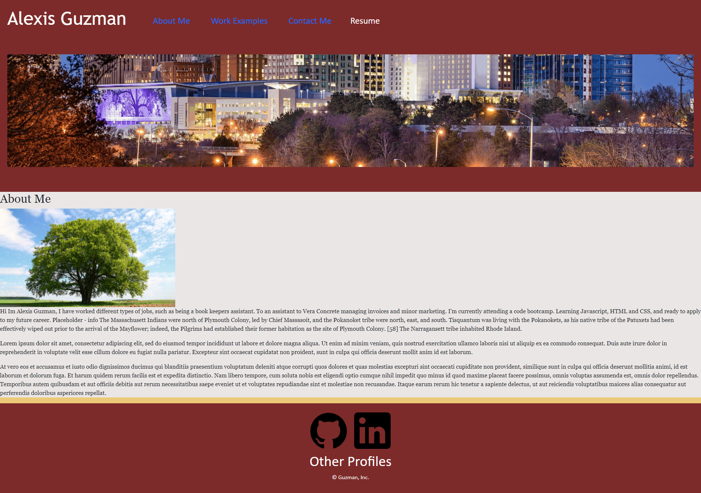
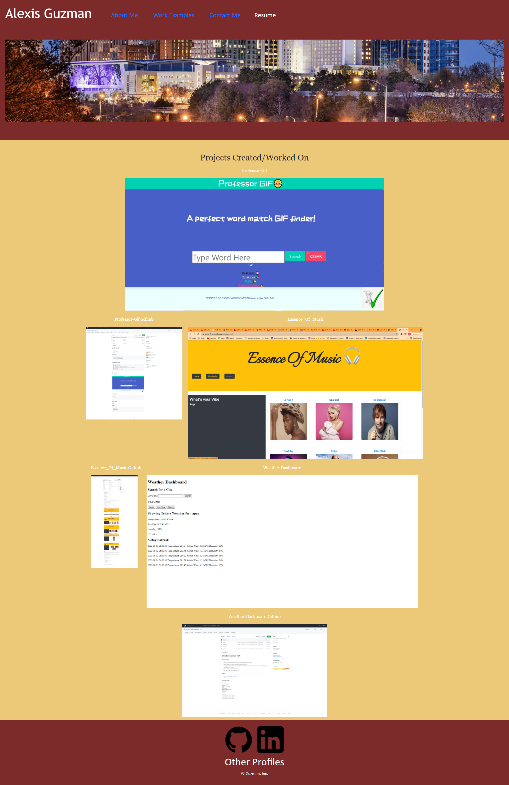

# React Portfolio Alexis Guzman

## Updated Description
1. Improved CSS layout to be mobile-friendly 
2. Added projects and homework that worked.
3. added links to my resume, LinkedIn and GitHub
4. updated portfolio with new projects
5. Updated Portfolio using react, and will be a continus work in progress for the future!

## Links
1. [Homework Deployed Website link](https://liladobe.github.io/react-portfolio-hw/)
2. [Github](https://github.com/LilAdobe/react-portfolio-hw)

## Screenshot

